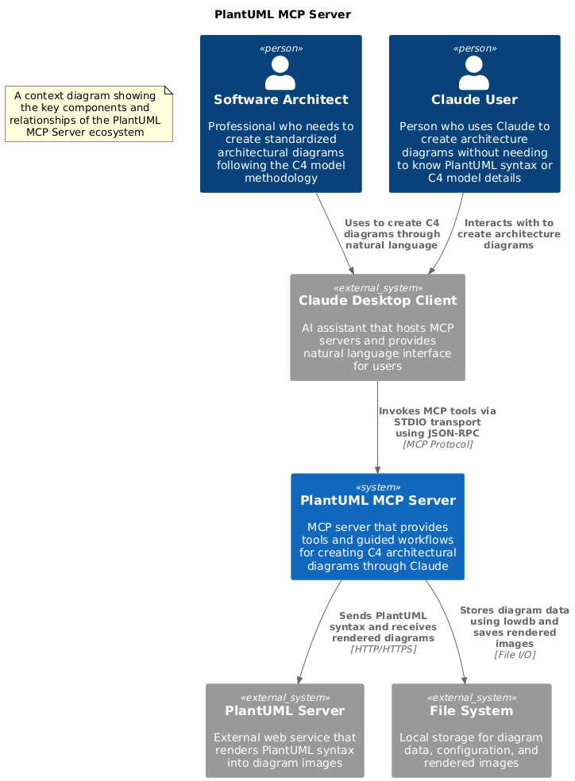

# C4 Diagram MCP Server

This project delivers an MCP server that enables creating architectural diagrams using PlantUML. The server helps you build your diagrams through natural conversation while ensuring adherence to [C4 abstractions and diagram types](https://c4model.com/).

The server uses [C4-PlantUML](https://github.com/plantuml-stdlib/C4-PlantUML) by referencing their raw `.puml` files in the generated PUML syntax for your diagram(s).

Here is an example of a context diagram generated exclusively by Claude for this code base:


## Supported Diagram Types

- Context diagrams
- Container diagrams
- Component diagrams
- Custom C4-styled type/interface/enum relationship diagrams, focused on their relationships with Containers and NOT including specific implementation details or properties (see example below)
- C4-styled sequence diagrams (no boundaries or indexing)

## Prerequisites

- Node.js 18 or higher
- npm 9 or higher
- Internet connection (for PlantUML server access)
- The official [Filesystem MCP server](https://github.com/modelcontextprotocol/servers/tree/main/src/filesystem) installed and configured
  - This C4 diagram MCP server will use the Filesystem MCP server to store the generated PUML source code and PNG images for your diagrams
  - The Filesystem MCP server should be configured to allow the root directory where you would like any C4 diagram projects to be stored
  - This dependency exists because the official Filesystem MCP server has an established security model for properly accessing your filesystem which we will leverage to ensure that the generated PUML source code and PNG images are stored in a secure manner

## Installation

1. Clone this repository

2. Install dependencies:
```bash
cd plantuml-mcp-server
npm install
```

3. Build the project:
```bash
npm run build
```

## Example Integration with Claude Desktop

1. Open Claude Desktop and access the config file:
   - macOS: `~/Library/Application Support/Claude/claude_desktop_config.json`
   - Windows: `%APPDATA%\Claude\claude_desktop_config.json`

2. Add the following configuration (adjust paths according to your environment):

    ```json
    {
      "mcpServers": {
        "filesystem": {
          "command": "npx",
          "args": [
            "-y",
            "@modelcontextprotocol/server-filesystem",
            "/path/to/your/desired/root/directory"
          ]
        },
        "c4-plantuml": {
          "command": "npx",
          "args": [
            "c4-plantuml-server"
          ]
        },
      }
    }
    ```

    As a tip, on Windows machines the path for the Filesystem MCP server configuration should be specified like `"C:\\my\\desired\\directory"`.

3. Restart Claude Desktop using `CTRL+Q` or `CMD+Q`

## Usage Examples

In the examples below, a single Markdown document containing some high-level design infomation for this example application was included in Claude's Project Knowledge. You can include more detailed information, code files, or use the Filesystem MCP server to point Claude to a directory containing the files you would like it to use as context for your project.

### Basic usage
The video below shows a user prompting Claude with a simple concept statement for an app they'd like to design. While an optional step, the user also feeds some documentation into the prompt to increase the accuracy of the generated design. The AI then generates a C4 Context diagram, as requested, by thinking through the design and then generating each of the elements and their relationships. The PUML syntax to support the diagram is constantly being updated on disk. When the AI determines it has finished, it generates a png image of the completed PUML source code and saves it to disk.

<video autoplay loop muted playsinline>
  <source src="doc/img/basic-usage.mp4" type="video/mp4">
</video>

### Creating additional diagrams
The video below shows a user asking Claude to create the next-detailed C4 diagram, a Container diagram, to zoom in on the system that was defined in the Context diagram. The AI follows a similar thinking step as seen before, then creates a new Container diagram in the same project, adds the elements and relationships that it determines to be necessary, and then generates a png image of the completed diagram when it's finished. This additional diagram is created in the same chat session, but you can split this up over multiple sessions as well. Check out the [Tips](#tips) section below for more details.

<video autoplay loop muted playsinline>
  <source src="/doc/img/additional-diagrams.mp4" type="video/mp4">
</video>

### Updating diagrams

The tool descriptions push the AI toward updating existing diagrams rather than creating new ones. You can make changes simply by prompting with something like "*Let's simplify this diagram by representing all of the disparate user personas as a single "HOA member" user*". If you would prefer to create a new version of your diagram instead, simply include that instruction in your prompt.

### Tips

- Having the official [Sequential Thinking MCP server](https://github.com/modelcontextprotocol/servers/tree/main/src/sequentialthinking) installed will greatly enhance your experience if you have a complex project by enabling the AI to think critically about your project to design the elements for your diagrams and their relationships.
- This tool will generate PUML source code and png images for your diagrams using a pre-configured directory structure. You can include the path where you would like that directory to be created in your initial prompt.
- If you generate different diagram levels across multiple chats, it is recommended that you upload the generated PUML source code from each completed diagram to the project knowledge (or utilize the `filesystem` MCP server and point Claude to the directory) so that it has access to all of the IDs to fetch in the database.
- If the call to the `generate-diagram-image` tool to create the png version of your diagram fails, as it sometimes does because we are using the public PlantUML server for this beta version of the code base, you can ask it to try again with a prompt like "Can you try again to generate the diagram image?".